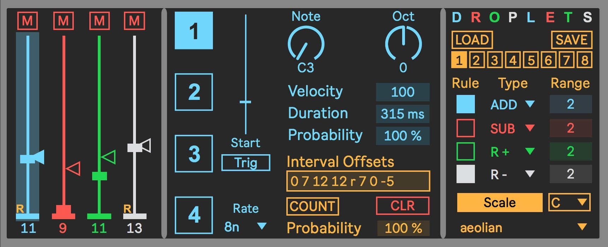
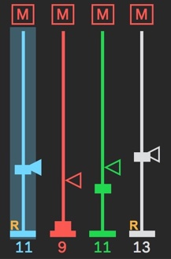
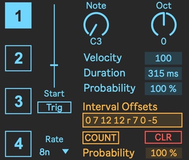
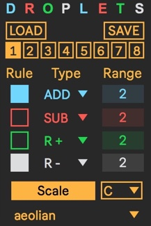
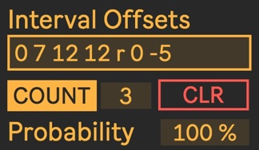

# Droplets

A Max For Live counter based note sequencer inspired by the excellent [Meadowphysics](https://monome.org/docs/meadowphysics/) patch/eurorack module from monome. Droplets is my attempt at repurposing a few of the ideas presented in Meadowphysics for use without a grid, while still trying to maintain an interface that invites experimentation and interaction.

Droplets is made up of four note events. A note event is dropped from a certain height, and when it reaches the ground that note event is triggered. Each note event is composed of a base pitch, velocity, duration and probability. A note event drops at its own clock rate (relative to Live's tempo), and features an interval offset list processing section that enables each note event to create a melody centered on the base pitch. Droplets can output four independent melodic sequences simultaneously. 

A note event's height can be subject to one of four rules when that note event is triggered (increment, decrement, positive random offset, negative random offset).

Outgoing notes can have their pitch quantized to a variety of scales.

### The Droplets interface is made up of three panels

&nbsp;&nbsp;&nbsp;&nbsp;&nbsp;&nbsp;&nbsp;&nbsp;&nbsp;&nbsp;&nbsp;&nbsp;&nbsp;&nbsp;Panel&nbsp;&nbsp;&nbsp;&nbsp;&nbsp;&nbsp;&nbsp;&nbsp;&nbsp;&nbsp;&nbsp;&nbsp;&nbsp;&nbsp;|Description
-----|-----------
 | The leftmost panel contains 4 color coded sliders. Each of these represent one note event, and are used to set the height from which a note event will be dropped. A mute button for each note event is located at the top of each height slider. When a note event has a trigger rule applied to it, a small letter "R" will appear at the lower left of the height slider.
 | The middle panel is used to set the parameters for each of the four note events. It will change its contents (and color) based on which of the four note events is currently selected.
 | The rightmost panel is the global area. It is used for preset management, setting the trigger rules for each note event, and for setting the global pitch quantization.

### About those interval offsets...

Each of the four note events contains its own interval offset list processor. The concept behind this comes from the integer notation approach to pitches you might find in live coding environments like Tidal Cycles and Sonic Pi - integer values represent musical semitones that are added to the value set by the Note and Oct controls. 

When you enter an integer value into the Interval Offsets text area, it will be added to the base pitch when that note event is triggered. If you enter more than one integer value (separated by spaces) into the Interval Offsets text area, the interval offsets will be added to the base pitch in succession, each time the note event is triggered. If you enter a lowercase r into the Interval Offsets text area, it will be processed as a rest and there will be no output when that element of the list is processed. As soon as you press the enter key, the interval offset list will be updated with any edits you've made.

*Note that you can add to and edit the list of interval offsets while the clock is running!* 

The Count button applies the integer offset(s) every N triggers, where N is the value set in the number box to the right of the Count button. For example, if you have a value of 12 in the Interval Offsets text area and the Count button enabled with a value of 3, the interval offset value will only be added to every 3rd trigger of that note event.

The CLR button clears the contents of the Interval Offsets text area, and isn't terribly exciting.

The Probability control sets the probability that the value(s) in the Interval Offsets text area will be added to the base pitch. This works independently from the Probability control in the main Note Event edit area.

### About those rules...

When a trigger rule is enabled for a note event, a yellow "R" will appear on that note event's height slider. This is in part because the height slider will not behave normally when a rule is enabled. Kind of hard to describe but just play with it and see. 
